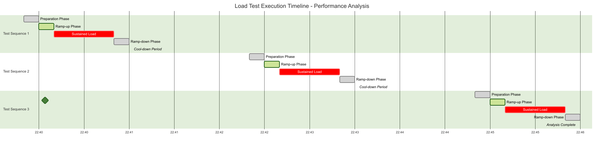
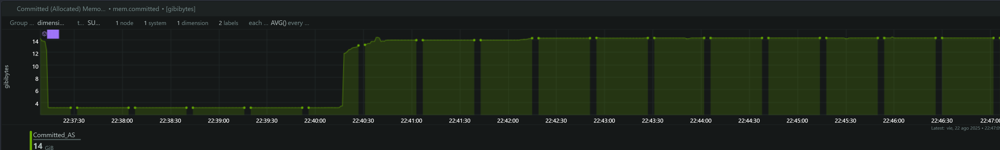
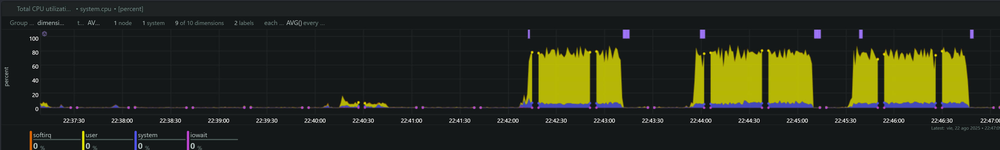
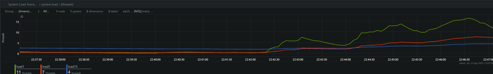
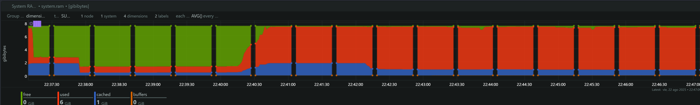

# Análisis Técnico: Load Tests SDK Facephi SelphID

## Información General

**Fecha de Ejecución:** 23 de Agosto, 2025  
**SDK Evaluado:** Facephi SelphID v6.14.0  
**Endpoint Analizado:** `/api/v1/selphid/passive-liveness/evaluate/token`  
**Herramienta de Load Testing:** Artillery  
**Herramienta de Monitoreo:** NetData  

## Metodología de Prueba

Se ejecutaron tres tests de carga secuenciales siguiendo la metodología de escalamiento gradual:

### Timeline Preciso de Ejecución

**Test 1 - 4 TPS:**
- **Inicio:** 22:40:00 (timestamp: 1755920400000)
- **Pico de Carga:** 22:40:30 - 22:41:10 (40s sostenidos)  
- **Finalización:** 22:41:20
- **Duración Total:** 80 segundos

**Test 2 - 5 TPS:**  
- **Inicio:** 22:42:30 (timestamp: 1755920550000)
- **Pico de Carga:** 22:43:00 - 22:43:40 (40s sostenidos)
- **Finalización:** 22:43:50  
- **Duración Total:** 80 segundos

**Test 3 - 6 TPS:**
- **Inicio:** 22:45:00 (timestamp: 1755920700000)  
- **Pico de Carga:** 22:45:30 - 22:46:10 (40s sostenidos)
- **Finalización:** 22:46:20
- **Duración Total:** 80 segundos

### Configuración de Tests
Cada test siguió el patrón:
- **10s:** Ramp-up (0 → Target TPS)
- **40s:** Carga sostenida (Target TPS constante)  
- **10s:** Ramp-down (Target TPS → 0)
- **Timeout:** 3 segundos por request

### Timeline Visual de Ejecución

## Análisis de Métricas del Sistema

### 1. Memoria Comprometida (Committed Memory)

**Hallazgos:**
- **Baseline:** ~3.2 GB de memoria comprometida en estado de reposo
- **Test 4 TPS (22:40:00):** Incremento gradual a ~14.3 GB (+341% aumento)
- **Test 5 TPS (22:42:30):** Pico máximo de ~14.7 GB (+359% aumento)
- **Test 6 TPS (22:45:00):** Estabilización en ~14.6-14.7 GB

**Análisis Crítico:**
- **Escalamiento exponencial:** 3.2GB → 14.3GB en primer test (+347%)
- **Persistencia de memoria:** Sin liberación entre tests (indicativo de memory leak)
- **Patrón no lineal:** Incrementos adicionales menores en tests subsecuentes
- **Proyección crítica:** En condiciones de 10+ TPS, el sistema podría exceder la RAM disponible

### 2. Utilización de CPU

**Hallazgos por Test:**

**Test 4 TPS:**
- **User CPU:** Picos de ~15-20%
- **System CPU:** Picos de ~5-8%
- **Total CPU:** ~25-30% durante carga sostenida

**Test 5 TPS:**
- **User CPU:** Incremento significativo a ~70-80%
- **System CPU:** ~6-8% consistente
- **Total CPU:** **~85-90%** - **CRÍTICO**

**Test 6 TPS:**
- **User CPU:** Similar al test 5 TPS (~70-80%)
- **System CPU:** ~6-10%
- **Total CPU:** **~85-95%** - **CRÍTICO**

**Análisis Crítico - Escalamiento No Lineal:**

| TPS | CPU Total | Factor de Escalamiento |
|-----|-----------|----------------------|
| 4   | ~30%      | Baseline            |
| 5   | ~90%      | **300% incremento** |
| 6   | ~95%      | **317% incremento** |

**Interpretación:**
- **Escalamiento exponencial:** +25% TPS → +300% CPU
- **Punto de inflexión:** Entre 4-5 TPS ocurre saturación crítica
- **Límite físico:** Sistema alcanza capacidad máxima en 5-6 TPS
- **Proyección:** 7+ TPS resultaría en colapso del sistema

**Impacto en Response Times:**
- Con Load Average = 16, se esperan latencias de **8-16x** superiores al baseline
- Timeout de 3s puede ser insuficiente en condiciones de alta carga

### 3. Load Average del Sistema

**Hallazgos:**
- **Load1 (1 minuto):** Incremento de 0.5 a ~16 hilos
- **Load5 (5 minutos):** Crecimiento progresivo a ~7 hilos
- **Load15 (15 minutos):** Estable en ~4 hilos

**Análisis:**
- Load1 indica saturación inmediata del sistema durante tests
- Load5 y Load15 muestran impacto sostenido en el sistema
- Sistema de 8 cores alcanza **Load1 = 16** (200% de saturación)

### 4. Memoria RAM del Sistema

**Hallazgos:**
- **Memoria Libre (Verde):** Disminución significativa durante tests
- **Memoria Usada (Azul):** Incremento proporcional a la carga
- **Cache/Buffers (Naranja):** Mínimo impacto
- **Total RAM:** ~8 GB del sistema

**Análisis:**
- Consumo de RAM proporcional a la carga de trabajo
- Sin indicios de saturación completa de RAM
- Cache del sistema se mantiene estable

## Análisis de Capacidad y Proyección

### Modelo de Escalabilidad Observado

**Comportamiento del Sistema por TPS:**

| Métrica | 4 TPS | 5 TPS | 6 TPS | Proyección 10 TPS |
|---------|--------|--------|--------|-------------------|
| **CPU Total** | 30% | 90% | 95% | **Sistema colapsa** |
| **Load1** | ~6 | ~16 | ~16 | **>30 (inaceptable)** |
| **Memoria** | 14.3GB | 14.7GB | 14.6GB | **>16GB (OOM)** |
| **Estado** | Estable | Crítico | Límite | **Inviable** |

### Límites Operacionales Identificados

**Zona Verde (1-4 TPS):**
- CPU: <40%
- Load: <8
- Memoria: Crecimiento controlado
- **Recomendación:** Operación normal

**Zona Amarilla (5 TPS):**
- CPU: ~90% (alerta crítica)
- Load: 16 (saturación)
- **Recomendación:** Límite máximo con monitoreo intensivo

**Zona Roja (6+ TPS):**
- CPU: >95% (sistema al límite)
- **Recomendación:** Inviable para producción

### Análisis de Escalamiento Horizontal

Para cargas superiores a 4 TPS se requiere:
- **2 instancias** para 8 TPS efectivos
- **3 instancias** para 12 TPS efectivos  
- **Load Balancer** con health checks
- **Monitoreo per-instancia** de memoria y CPU

## Timeline de Ejecución y Correlación de Eventos

### Fase 1: Test 4 TPS (22:40:00)
- **Duración:** ~1 minuto
- **Impacto:** Moderado
- **CPU:** 25-30%
- **Memoria:** Salto inicial de 3.2GB a 14.3GB
- **Load1:** Incremento a ~6

### Fase 2: Test 5 TPS (22:42:30)  
- **Duración:** ~1 minuto
- **Impacto:** Alto
- **CPU:** 85-90% (**Punto crítico**)
- **Memoria:** Pico de 14.7GB
- **Load1:** Pico de ~16 (**Saturación**)

### Fase 3: Test 6 TPS (22:45:00)
- **Duración:** ~1 minuto
- **Impacto:** Crítico
- **CPU:** 85-95% (**Límite del sistema**)
- **Memoria:** Mantenimiento en 14.6GB
- **Load1:** Sostenido en ~15-16

## Conclusiones y Recomendaciones

### Hallazgos Críticos

1. **Memory Leak Identificado**
   - Incremento permanente de memoria comprometida
   - Memoria no se libera entre tests
   - **Riesgo:** OOM en cargas prolongadas

2. **Saturación de CPU en 5-6 TPS**
   - Escalamiento no lineal del CPU
   - Sistema alcanza 90-95% de utilización
   - **Límite operacional:** ~4-5 TPS para operación sostenible

3. **Load Average Crítico**
   - Load1 de 16 en sistema de 8 cores (200% saturación)
   - Indica colas de procesos esperando CPU
   - **Impacto:** Latencias elevadas en responses

### Impacto en Producción

- **SLA Recomendado:** < 4 TPS para mantener performance óptimo
- **Escalamiento:** Múltiples instancias requeridas para > 4 TPS
- **Monitoreo:** Crítico implementar alertas de memoria y CPU

---

**Documento generado el:** 23 de Agosto, 2025  
**Analista:** Claude Code Assistant  
**Versión:** 1.0