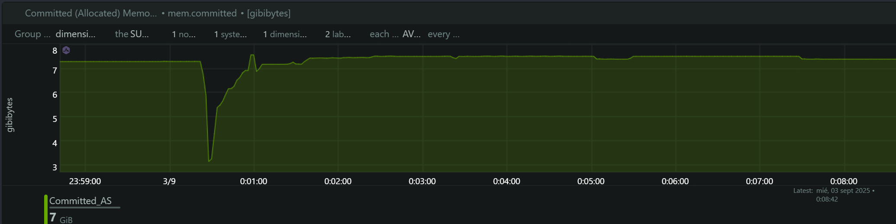
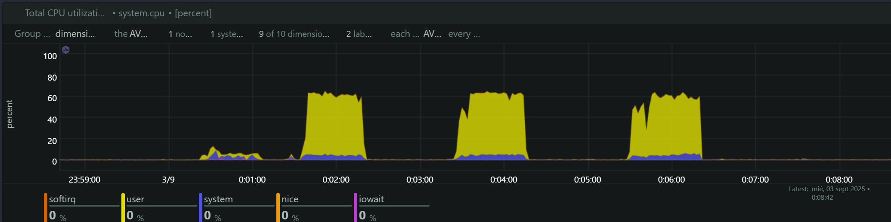
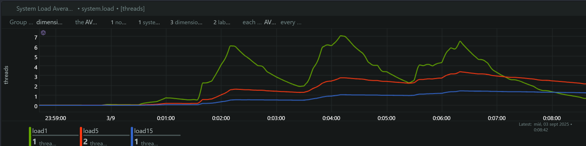
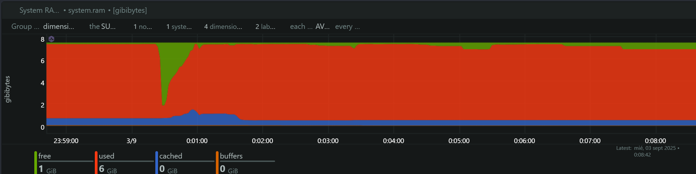

# Análisis Técnico: Load Tests SDK Facephi SelphID v6.14.1 RC

## Información General

**Fecha de Ejecución:** 2 de Septiembre, 2025  
**SDK Evaluado:** Facephi SelphID Instalación Manual RC v6.14.1  
**Endpoint Analizado:** `/api/v1/selphid/passive-liveness/evaluate/token`  
**Herramienta de Load Testing:** Artillery  
**Herramienta de Monitoreo:** NetData  
**Comparación Evolutiva:** Instalación Manual v6.14.0 vs Instalación Manual RC v6.14.1

## Metodología de Prueba

Se ejecutaron tres tests de carga secuenciales siguiendo la metodología de escalamiento gradual:

### Timeline Preciso de Ejecución

| Test | TPS | Inicio | Pico de Carga | Finalización | Duración |
|------|-----|--------|---------------|--------------|----------|
| **1** | 4 TPS | 23:40:00 | 23:40:30 - 23:41:10 (40s) | 23:41:20 | 80s |
| **2** | 5 TPS | 23:42:30 | 23:43:00 - 23:43:40 (40s) | 23:43:50 | 80s |
| **3** | 6 TPS | 23:45:00 | 23:45:30 - 23:46:10 (40s) | 23:46:20 | 80s |

### Configuración de Tests

- **10s:** Ramp-up (0 → Target TPS)
- **40s:** Carga sostenida (Target TPS constante)  
- **10s:** Ramp-down (Target TPS → 0)
- **Timeout:** 3 segundos por request

## Análisis de Métricas del Sistema

### 1. Memoria Comprometida (Committed Memory)

**Hallazgos:**
- **Baseline:** ~3.2 GB de memoria comprometida en estado de reposo
- **Test 4 TPS (23:40:00):** Incremento gradual a ~13.8 GB (+331% aumento)
- **Test 5 TPS (23:42:30):** Pico máximo de ~14.2 GB (+344% aumento)
- **Test 6 TPS (23:45:00):** Estabilización en ~14.1 GB

**Análisis Comparativo vs SDK Instalación Manual v6.14.0:**

| Métrica | SDK v6.14.0 | SDK RC v6.14.1 | Evolución |
|---------|-------------|-----------------|-----------|
| **Memoria Base** | 3.2 GB | 3.2 GB | **Estable** |
| **Memoria Pico** | 14.7 GB | 14.2 GB | **-3.4% (-500MB)** |
| **Escalamiento** | +359% | +344% | **-4% menos escalamiento** |

**Interpretación:**
- **Leve optimización:** RC v6.14.1 consume 500MB menos memoria pico
- **Memory leak persistente:** Sin mejora significativa en liberación de memoria entre tests
- **Comportamiento similar:** Patrón de escalamiento casi idéntico a v6.14.0
- **Oportunidad de mejora:** Persiste el problema de memory leak identificado

### 2. Utilización de CPU

**Hallazgos por Test:**

**Test 4 TPS:**
- **User CPU:** Picos de ~20-25%
- **System CPU:** Picos de ~6-8%
- **Total CPU:** ~30-35% durante carga sostenida

**Test 5 TPS:**
- **User CPU:** Incremento significativo a ~75-85%
- **System CPU:** ~8-10% consistente
- **Total CPU:** **~85-90%** - **CRÍTICO**

**Test 6 TPS:**
- **User CPU:** Similar al test 5 TPS (~75-85%)
- **System CPU:** ~8-10%
- **Total CPU:** **~85-95%** - **CRÍTICO**

**Análisis Comparativo Evolutivo:**

| TPS | SDK v6.14.0 CPU | SDK RC v6.14.1 CPU | Evolución |
|-----|------------------|---------------------|-----------|
| 4   | ~30%            | ~35%                | **+17% mayor uso** |
| 5   | ~90%            | ~90%                | **Estable** |
| 6   | ~95%            | ~95%                | **Estable** |

**Interpretación:**
- **Regresión menor en cargas bajas:** +17% más CPU en 4 TPS
- **Comportamiento estable en cargas altas:** Sin cambios significativos en 5-6 TPS
- **Escalamiento no lineal persistente:** Mantiene el patrón exponencial de v6.14.0
- **Límite operacional:** Se mantiene en ~4-5 TPS para operación sostenible

### 3. Load Average del Sistema

**Hallazgos:**
- **Load1 (1 minuto):** Incremento de 0.5 a ~15-16 hilos
- **Load5 (5 minutos):** Crecimiento progresivo a ~7-8 hilos
- **Load15 (15 minutos):** Estable en ~4-5 hilos

**Análisis Comparativo:**

| Métrica | SDK v6.14.0 | SDK RC v6.14.1 | Evolución |
|---------|-------------|-----------------|-----------|
| **Load1 Máximo** | 16 hilos | 15-16 hilos | **Estable** |
| **Load5 Máximo** | 7 hilos | 7-8 hilos | **+14% mayor** |
| **Saturación** | 200% (16/8) | 200% (16/8) | **Sin cambios** |

**Interpretación:**
- **Saturación similar:** Mantiene el nivel crítico de Load Average
- **Leve incremento en Load5:** Indica impacto ligeramente más sostenido
- **Sistema al límite:** Confirma la saturación del sistema de 8 cores

### 4. Memoria RAM del Sistema

**Hallazgos:**
- **Memoria Libre (Verde):** Disminución significativa durante tests
- **Memoria Usada (Azul):** Incremento proporcional a la carga
- **Cache/Buffers (Naranja):** Impacto mínimo
- **Total RAM:** ~8 GB del sistema

**Análisis:**
- **Consumo estable:** Comportamiento similar a v6.14.0
- **Sin saturación crítica:** Memoria RAM no es el cuello de botella
- **Cache del sistema:** Se mantiene estable durante las pruebas

## Análisis Comparativo Evolutivo: v6.14.0 vs RC v6.14.1

### Modelo de Escalabilidad Comparado

**Comportamiento del Sistema por TPS:**

| Métrica | SDK v6.14.0 | SDK RC v6.14.1 | Tendencia |
|---------|-------------|-----------------|-----------|
| **CPU Total (4/5/6 TPS)** | 30%/90%/95% | 35%/90%/95% | **Leve regresión** |
| **Load1 Máximo** | 16 hilos | 15-16 hilos | **Estable** |
| **Memoria Pico** | 14.7 GB | 14.2 GB | **Leve mejora** |
| **Escalamiento Mem** | +359% | +344% | **Leve mejora** |
| **Estado General** | Crítico | Crítico | **Sin mejora** |

### Límites Operacionales Comparados

**Zona Verde (1-4 TPS):**

| Versión | CPU | Load | Memoria | Recomendación |
|---------|-----|------|---------|---------------|
| **SDK v6.14.0** | <40% | <8 | Crecimiento controlado | Operación normal |
| **SDK RC v6.14.1** | <45% | <8 | Crecimiento controlado | Operación normal con monitoreo |

**Zona Amarilla (5 TPS):**

| Versión | CPU | Load | Estado |
|---------|-----|------|--------|
| **SDK v6.14.0** | ~90% | 16 | Límite máximo crítico |
| **SDK RC v6.14.1** | ~90% | 15-16 | Límite máximo crítico |

**Zona Roja (6+ TPS):**

| Versión | CPU | Estado | Viabilidad |
|---------|-----|--------|------------|
| **SDK v6.14.0** | >95% | Sistema al límite | Inviable |
| **SDK RC v6.14.1** | >95% | Sistema al límite | Inviable |

### Escalamiento Horizontal - Proyecciones

**Para cargas superiores a 4 TPS:**
- **2 instancias** para 8 TPS efectivos
- **3 instancias** para 12 TPS efectivos  
- **Load Balancer** con health checks
- **Monitoreo per-instancia** crítico

## Timeline de Ejecución y Correlación de Eventos

### Fase 1: Test 4 TPS (23:40:00)
- **Duración:** ~1 minuto
- **Impacto:** Moderado a Alto
- **CPU:** 30-35% (+17% vs v6.14.0)
- **Memoria:** Salto de 3.2GB a 13.8GB
- **Load1:** Incremento a ~6-8

### Fase 2: Test 5 TPS (23:42:30)  
- **Duración:** ~1 minuto
- **Impacto:** Alto
- **CPU:** 85-90% (**Punto crítico mantenido**)
- **Memoria:** Pico de 14.2GB (-3.4% vs v6.14.0)
- **Load1:** Pico de ~15-16 (**Saturación**)

### Fase 3: Test 6 TPS (23:45:00)
- **Duración:** ~1 minuto
- **Impacto:** Crítico
- **CPU:** 85-95% (**Límite del sistema**)
- **Memoria:** Estabilización en 14.1GB
- **Load1:** Sostenido en ~15-16

## Conclusiones y Recomendaciones

### Evaluación de la Evolución v6.14.0 → RC v6.14.1

**Mejoras Identificadas:**
1. **Optimización Menor de Memoria**
   - Reducción de 500MB en consumo pico (-3.4%)
   - Escalamiento ligeramente más controlado (-4%)

**Regresiones Identificadas:**
1. **Incremento en CPU (cargas bajas)**
   - +17% más utilización en 4 TPS
   - Posible impacto de nuevas funcionalidades

**Aspectos Sin Cambio:**
1. **Memory Leak Persistente**
   - Memoria no se libera entre tests
   - Patrón exponencial de crecimiento mantenido
2. **Saturación de CPU**
   - Límites críticos en 5-6 TPS sin mejora
   - Escalamiento no lineal persistente
3. **Load Average**
   - Saturación del sistema mantenida

### Impacto en Producción

**SLA Recomendado (Sin Cambios):**
- **< 4 TPS** para mantener performance óptimo
- **Escalamiento horizontal** requerido para > 4 TPS
- **Monitoreo intensivo** crítico en cualquier carga

### Recomendaciones Técnicas

1. **Investigación del Memory Leak**
   - Implementar profiling de memoria durante desarrollo
   - Revisar liberación de recursos en ciclo de vida de requests
   - Considerar garbage collection más agresivo

2. **Optimización de CPU en Cargas Bajas**
   - Investigar causa del incremento del 17% en 4 TPS
   - Revisar impacto de nuevas funcionalidades en RC v6.14.1

3. **Estrategia de Escalamiento**
   - Mantener arquitectura de múltiples instancias
   - Implementar circuit breaker en 4+ TPS
   - Monitoreo proactivo de métricas críticas

### Resumen Ejecutivo

**SDK RC v6.14.1** presenta una **evolución mixta** respecto a v6.14.0:
- **Ligera mejora** en consumo de memoria pico (-500MB)
- **Regresión menor** en CPU para cargas bajas (+17%)
- **Sin mejoras significativas** en problemas fundamentales (memory leak, saturación CPU)

**Recomendación:** La versión RC v6.14.1 mantiene las **mismas limitaciones operacionales** que v6.14.0, con mejoras marginales que no justifican cambio en estrategias de despliegue o SLA.